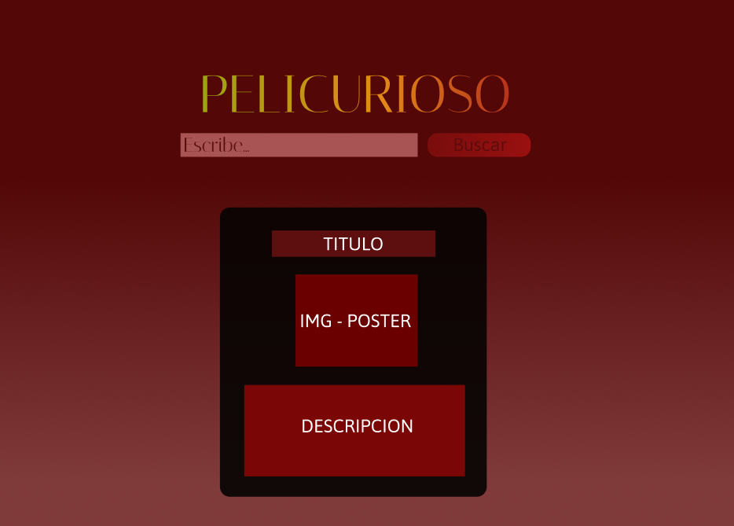
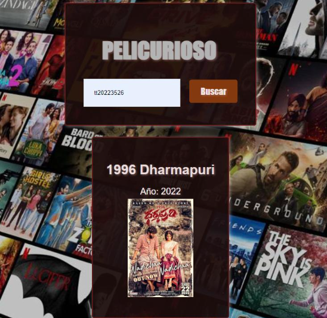
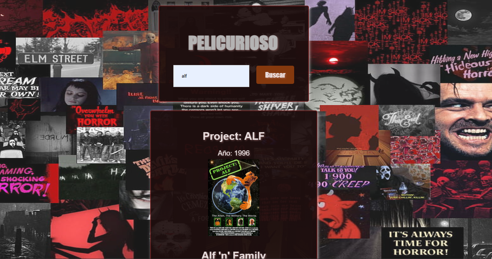
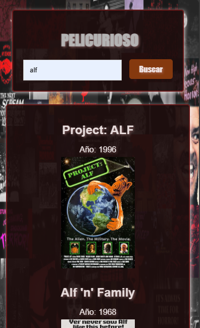

# Movie Challenge

## Índice

- [1. Preámbulo](#1-preambulo)
- [2. Resumen del proyecto](#2-resumen-del-proyecto)
- [3. Consideraciones técnicas](#3-consideraciones-tecnicas)
- [4. Prototipo](#5-prototipo)
- [5. Diseño final](#6-diseño-final)

---

## 1. Preámbulo

En la actualidad, la búsqueda de películas por título y año se ha vuelto una actividad común gracias a diversas herramientas en línea. Aunque antes debíamos recurrir a múltiples fuentes para obtener información sobre películas específicas, ahora podemos acceder a esta información de manera rápida y conveniente a través de buscadores especializados. Este cambio en la forma en que accedemos a los detalles de las películas refleja la evolución de la tecnología y la comodidad que ofrece a los espectadores. En este contexto, surge la oportunidad de desarrollar productos y experiencias que mejoren aún más esta búsqueda, brindando una experiencia intuitiva y eficiente para los usuarios que desean encontrar películas específicas.


## 2. Resumen del proyecto

La idea de este proyecto es desarrollar una aplicación web que aproveche los datos de películas proporcionados por la API de OMDB (The Open Movie Database). El objetivo es crear una experiencia atractiva para los usuarios, permitiéndoles explorar películas, obtener información detallada y disfrutar de funcionalidades adicionales relacionadas con el mundo cinematográfico.

### Objetivos Generales:

- Construcción de una interfaz intuitiva y atractiva.
- Implementación de funcionalidades basadas en datos de películas utilizando JavaScript.
- Garantizar la compatibilidad y la adaptabilidad de la aplicación en diferentes dispositivos y tamaños de pantalla.
- Proporcionar una propuesta de valor única que distinga la aplicación de otras soluciones similares.


## 3. Consideraciones técnicas

El desarrollo de la aplicación se basará en tecnologías web estándar, incluyendo HTML, CSS y JavaScript. Se utilizará Fetch u otra API para acceder a los datos de películas proporcionados por OMDB. Se aplicarán buenas prácticas de desarrollo, como el test-driven development (TDD) y el uso de linters para garantizar la calidad del código.

### Estructura de archivos

```text
.
├── .vscode
├── .node_modules
├── explaindev.json
├── package-lock.json
├── package.json
├── README.md
└── src
    ├── api.js
    ├── index.html
    ├── main.js
    ├── style.css
    └── .imagenes
```

## 4. Prototipos

Durante el proceso de desarrollo, se realizaron prototipos y diseños preliminares para definir la apariencia y la experiencia de usuario de la aplicación. Estos prototipos ayudaron a visualizar y refinar las funcionalidades antes de su implementación.

### Figma



### En proceso de creacion




## 5. Diseño final

### WEB



### MOVIL

